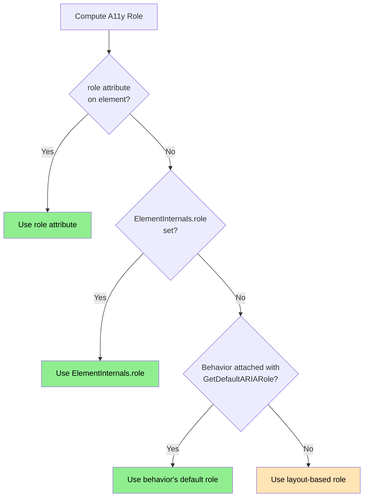

```mermaid
flowchart TD
    A[Compute A11y Role] --> B{role attribute<br/>on element?}
    B -->|Yes| C[Use role attribute]
    B -->|No| D{ElementInternals.role<br/>set?}
    D -->|Yes| E[Use ElementInternals.role]
    D -->|No| F{"Behavior attached with<br/>GetDefaultARIARole?"}
    F -->|Yes| G[Use behavior's default role]
    F -->|No| H[Use layout-based role]

    style C fill:#90EE90,color:#000000
    style E fill:#90EE90,color:#000000
    style G fill:#90EE90,color:#000000
    style H fill:#FFE4B5,color:#000000
```
