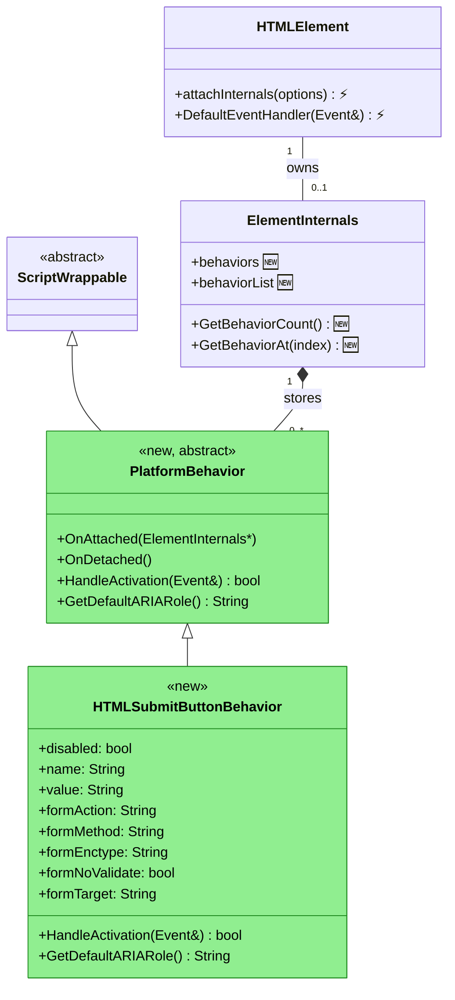

```mermaid
classDiagram
    class ScriptWrappable {
        <<abstract>>
    }
    
    class PlatformBehavior {
        <<new, abstract>>
        +OnAttached(ElementInternals*)
        +OnDetached()
        +HandleActivation(Event&) bool
        +GetDefaultARIARole() String
    }
    
    class HTMLSubmitButtonBehavior {
        <<new>>
        +disabled: bool
        +name: String
        +value: String
        +formAction: String
        +formMethod: String
        +formEnctype: String
        +formNoValidate: bool
        +formTarget: String
        +HandleActivation(Event&) bool
        +GetDefaultARIARole() String
    }
    
    class ElementInternals {
        +behaviors 🆕
        +behaviorList 🆕
        +GetBehaviorCount() 🆕
        +GetBehaviorAt(index) 🆕
    }
    
    class HTMLElement {
        +attachInternals(options) ⚡
        +DefaultEventHandler(Event&) ⚡
    }
    
    ScriptWrappable <|-- PlatformBehavior
    PlatformBehavior <|-- HTMLSubmitButtonBehavior
    ElementInternals "1" *-- "0..*" PlatformBehavior : stores
    HTMLElement "1" -- "0..1" ElementInternals : owns
    
    style PlatformBehavior fill:#90EE90,stroke:#228B22,color:#000000
    style HTMLSubmitButtonBehavior fill:#90EE90,stroke:#228B22,color:#000000
```

*Legend: 🆕 = new member, ⚡ = modified method, green fill = new class*
