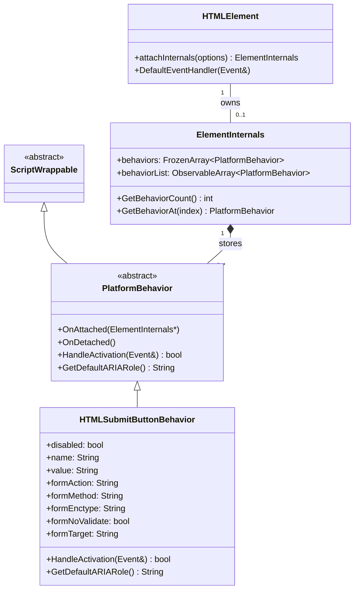

```mermaid
classDiagram
    class ScriptWrappable {
        <<abstract>>
    }
    
    class PlatformBehavior {
        <<abstract>>
        +OnAttached(ElementInternals*)
        +OnDetached()
        +HandleActivation(Event&) bool
        +GetDefaultARIARole() String
    }
    
    class HTMLSubmitButtonBehavior {
        +disabled: bool
        +name: String
        +value: String
        +formAction: String
        +formMethod: String
        +formEnctype: String
        +formNoValidate: bool
        +formTarget: String
        +HandleActivation(Event&) bool
        +GetDefaultARIARole() String
    }
    
    class ElementInternals {
        +behaviors: FrozenArray~PlatformBehavior~
        +behaviorList: ObservableArray~PlatformBehavior~
        +GetBehaviorCount() int
        +GetBehaviorAt(index) PlatformBehavior
    }
    
    class HTMLElement {
        +attachInternals(options) ElementInternals
        +DefaultEventHandler(Event&)
    }
    
    ScriptWrappable <|-- PlatformBehavior
    PlatformBehavior <|-- HTMLSubmitButtonBehavior
    ElementInternals "1" *-- "0..*" PlatformBehavior : stores
    HTMLElement "1" -- "0..1" ElementInternals : owns
```
