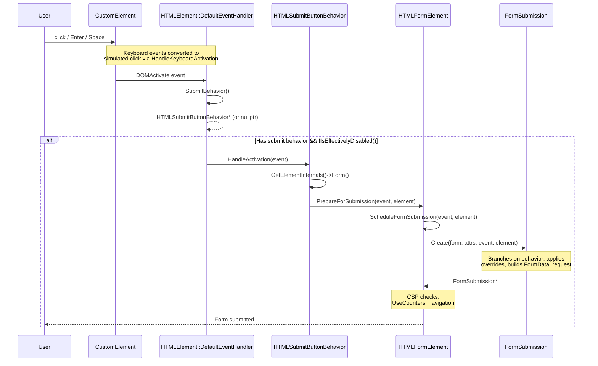

```mermaid
sequenceDiagram
    participant User
    participant CustomElement
    participant HTMLElement as HTMLElement::DefaultEventHandler
    participant Behavior as HTMLSubmitButtonBehavior
    participant Form as HTMLFormElement
    participant FS as FormSubmission

    User->>CustomElement: click / Enter / Space
    Note over CustomElement,HTMLElement: Keyboard events converted to<br/>simulated click via HandleKeyboardActivation
    CustomElement->>HTMLElement: DOMActivate event
    HTMLElement->>HTMLElement: SubmitBehavior()
    HTMLElement-->>HTMLElement: HTMLSubmitButtonBehavior* (or nullptr)
    alt Has submit behavior && !IsEffectivelyDisabled()
        HTMLElement->>Behavior: HandleActivation(event)
        Behavior->>Behavior: GetElementInternals()->Form()
        Behavior->>Form: PrepareForSubmission(event, element)
        Form->>Form: ScheduleFormSubmission(event, element)
        Form->>FS: Create(form, attrs, event, element)
        Note over FS: Branches on behavior: applies<br/>overrides, builds FormData, request
        FS-->>Form: FormSubmission*
        Note over Form: CSP checks,<br/>UseCounters, navigation
        Form-->>User: Form submitted
    end
```
